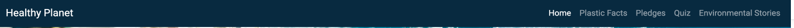
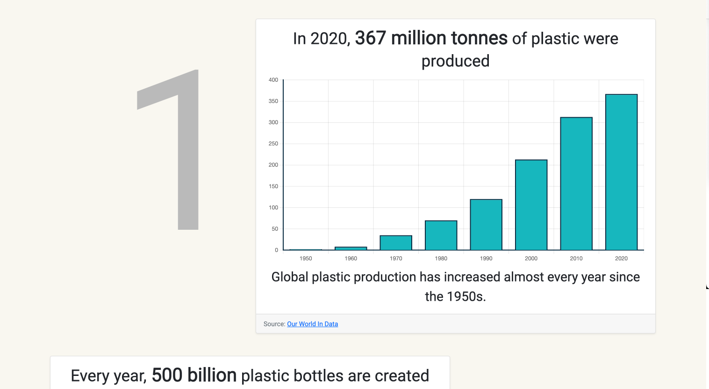
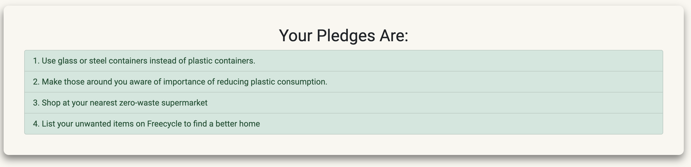
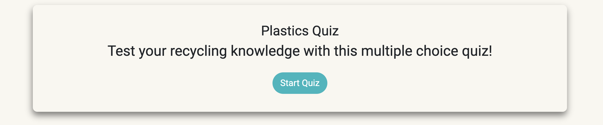
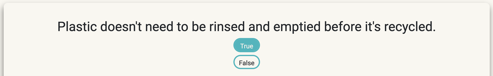
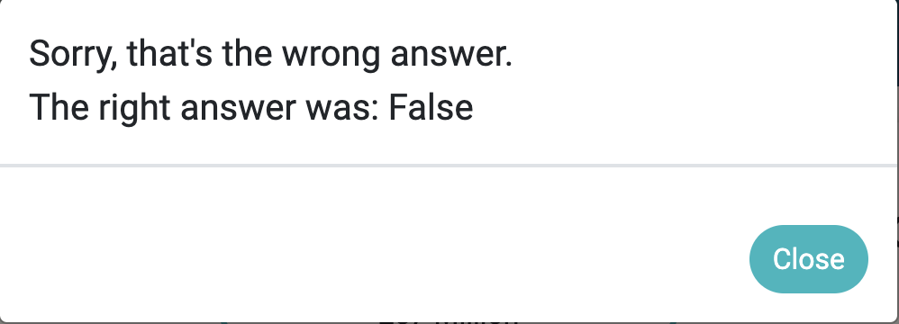
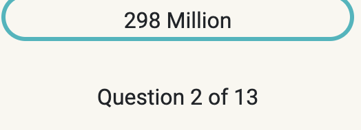
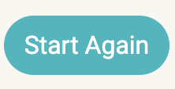
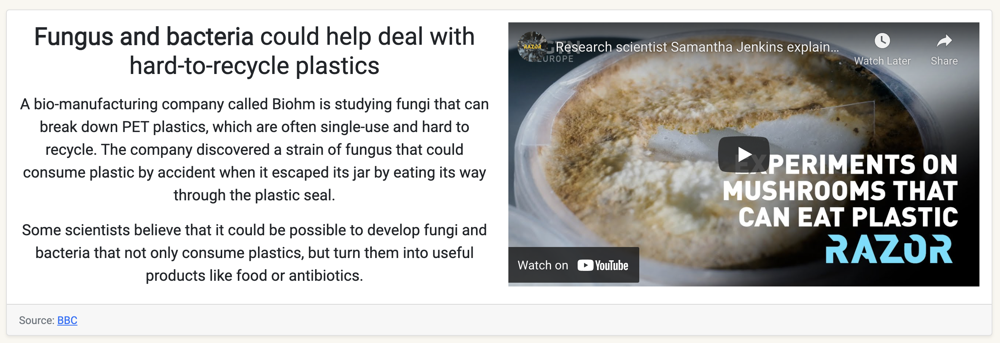

# Wireframes

[Return to Main README](../../../README.md)

## Contents

- [Navigation Bar](#navigation-bar)
- [Hero Image](#hero-image)
- [Social Links](#social-links)
- [Plastic Facts](#plastic-facts)
- [Pledge Answers](#pledge-answers)
- [Choose Pledges](#choose-pledges)
- [Quiz Start](#quiz-start)
- [Quiz Questions](#quiz-questions)
- [Quiz Feedback](#quiz-feedback)
- [Quiz Question Counter](#quiz-question-counter)
- [Quiz Submit Button](#quiz-submit-button)
- [Quiz Start Again Button](#quiz-start-again-button)
- [Success Stories](#success-stories)

*** 

### Navigation Bar

- Built with Bootstrap 5, the navbar is fully responsive, highlights the active page and shrinks to a burger icon on smaller dimensions

### Hero Image

- The Home Page features large hero images with statements about the current state of plastic waste on Earth. Each page features a smaller version of the primary image to keep the site consistent, while overlaying the page title so users can navigate effectively.

### Social Links

Links to popular social media sites, along with the github repository are featured in the footer for users to get in touch if they wish.

### Plastic Facts

- A facts page where users can learn more about the environmental impact plastic waste has. The page features animated graphs, and a relevant image for each fact.

### Choose Pledges

- A page where users can pledge to help the environment in their day to day lives, encouraging small change. There are numerous pledges to choose from, some of which the user may not have realised they can do.

### Pledge Answers

- Once the user has chosen some pledges, they are displayed in a list on a seperate page, to more cleary distinguish which ones were chosen.

### Quiz Start

- A button to begin the quiz so the user has a choice and doesn't feel pressured to take part. All quiz buttons have a similar design, so this will also teach the user how to continue playing.

### Quiz Questions

- Questions differ from True or False, to Multiple Choice, and the options are displayed accordingly, injected into the container with Javascript.

### Quiz Feedback

- After the user submits an answer, a modal pops up to give feedback on whether the user was right or wrong. If wrong, the correct answer is displayed, so that the user can still learn about the environment rather than having to seek out the answer elsewhere.

### Quiz Question Counter

- To keep users interested, and to allow them to check their progress, a running total of questions is displayed directly below the answer options.

### Quiz Submit Button

- As a defensive mechanism, users must press the submit button to register their answer. This helps prevent mistakes, as the user may want to change their mind.

### Quiz Start Again Button

- In case the user does make a mistake, or wants to quit early, a start again button is displayed below the submit button, which will reset the scores and return to the quiz home page.

### Success Stories

- In case the user wishes to see how recyling plastic on a grander scale looks, this page features several projects that have had a positive impact on the environment.

***

[Return to Main README](../../../README.md)